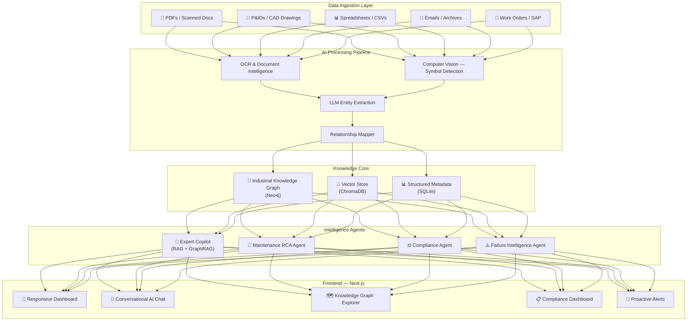
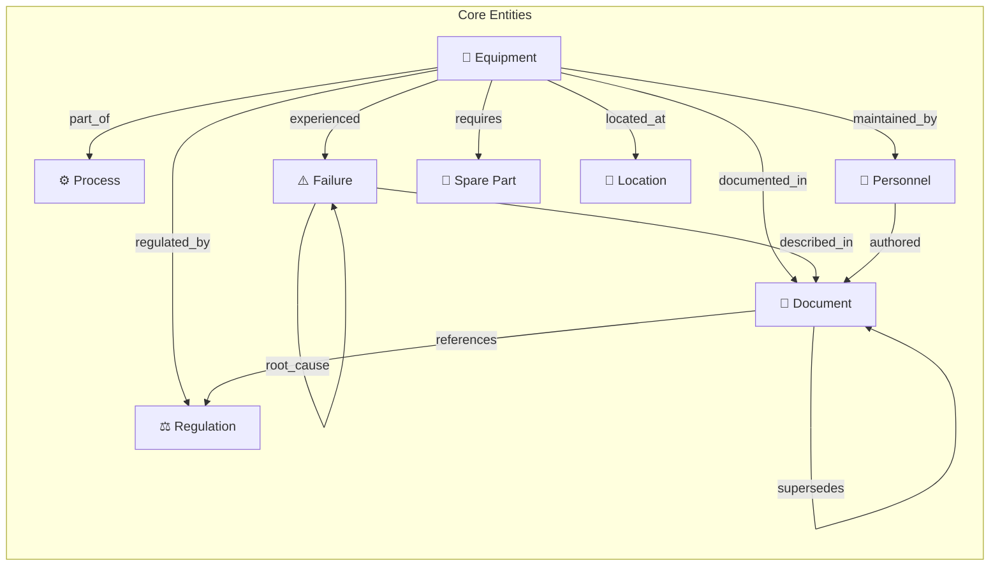

# IndustrialBrain — AI for Industrial Knowledge Intelligence

> **Unified Asset & Operations Brain**: An AI-powered platform that unifies fragmented industrial knowledge across engineering drawings, maintenance records, safety procedures, inspection reports, and regulatory documents — making decades of operational intelligence queryable, actionable, and continuously updated.

---

## Problem Summary

| Metric | Impact |
|--------|--------|
| **35%** of working hours wasted searching for information (McKinsey 2024) |
| **7–12** disconnected document systems per large Indian plant (NASSCOM-EY) |
| **18–22%** of unplanned downtime due to knowledge fragmentation (BIS Research) |
| **25%** of experienced engineers retiring within a decade — taking undocumented knowledge |

---

## Platform Name: **IndustrialBrain**

### Tagline: *"Every document connected. Every answer sourced. Every risk visible."*

---

## High-Level Architecture



---

## User Review Required

> [!IMPORTANT]
> **API Key Decision**: The platform uses Google Gemini API for LLM capabilities (free tier available). Please confirm you have or can obtain a Gemini API key. Alternatively, we can use fully local models via Ollama (llama3.2) — but response quality may be lower.

> [!IMPORTANT]  
> **Scope Confirmation**: This plan covers ALL 5 modules from the problem statement. Given the scope, I recommend we build all modules with the Expert Copilot and Knowledge Graph as the deepest implementations, while the other agents operate as functional demonstrations. Does this prioritization align with your vision?

> [!WARNING]
> **Demo Data**: Since we likely don't have real industrial documents, I will generate **realistic synthetic industrial data** — P&ID excerpts, maintenance work orders, inspection reports, SOPs, and compliance records — that mirror real-world formats. This is standard practice for hackathon prototypes.

---

## Open Questions

> [!IMPORTANT]
> 1. **LLM Provider**: Google Gemini (recommended, free tier) vs. OpenAI vs. Local Ollama? This affects entity extraction quality significantly.
> 2. **Deployment Target**: Run locally for demo, or deploy to cloud (Vercel + Railway)?
> 3. **Demo Duration**: How long is the expected demo video? This affects which features we polish most.

---

## Technology Stack

| Layer | Technology | Rationale |
|-------|-----------|-----------|
| **Frontend** | Next.js 14 (App Router) + Vanilla CSS | Modern SSR, streaming UI for AI responses |
| **Backend** | FastAPI (Python 3.11+) | Async, AI/ML ecosystem, fast prototyping |
| **LLM** | Google Gemini 2.0 Flash | Free tier, strong extraction, multimodal |
| **Vector DB** | ChromaDB | Local, zero-config, Python-native |
| **Graph DB** | Neo4j (Community) or NetworkX | Knowledge graph with Cypher queries |
| **OCR** | EasyOCR + pdf2image | Multi-language, GPU-accelerated |
| **CV (P&ID)** | YOLOv8 + OpenCV | Symbol detection & line tracing |
| **Embeddings** | sentence-transformers (all-MiniLM-L6-v2) | Fast, accurate, local |
| **Task Queue** | Celery + Redis | Async document processing |
| **Database** | SQLite | Lightweight metadata store |
| **Charts** | Chart.js / D3.js | Interactive dashboards |
| **Graph Viz** | vis-network / react-force-graph | Interactive knowledge graph explorer |

---

## Proposed Changes

### Component 1: Project Foundation & Scaffolding

> Set up the monorepo structure, install dependencies, and configure the development environment.

#### [NEW] Project Root Structure

```
industrial-brain/
├── backend/                    # FastAPI Python backend
│   ├── app/
│   │   ├── main.py            # FastAPI app entry point
│   │   ├── config.py          # Environment & settings
│   │   ├── models/            # Pydantic data models
│   │   ├── routers/           # API route handlers
│   │   │   ├── ingestion.py   # Document upload & processing
│   │   │   ├── query.py       # RAG query endpoint
│   │   │   ├── knowledge.py   # Knowledge graph API
│   │   │   ├── compliance.py  # Compliance agent API
│   │   │   └── maintenance.py # Maintenance agent API
│   │   ├── agents/            # AI Agent implementations
│   │   │   ├── copilot.py     # Expert Knowledge Copilot
│   │   │   ├── rca_agent.py   # Root Cause Analysis agent
│   │   │   ├── compliance_agent.py
│   │   │   └── failure_agent.py
│   │   ├── services/          # Core business logic
│   │   │   ├── document_processor.py  # OCR + extraction pipeline
│   │   │   ├── entity_extractor.py    # LLM-based NER
│   │   │   ├── knowledge_graph.py     # Graph operations
│   │   │   ├── vector_store.py        # ChromaDB operations
│   │   │   └── pid_parser.py          # P&ID computer vision
│   │   └── data/              # Seed data & ontology definitions
│   │       ├── ontology/      # Industrial ontology schemas
│   │       ├── seed/          # Sample industrial documents
│   │       └── regulatory/    # Indian regulatory frameworks
│   ├── requirements.txt
│   └── Dockerfile
├── frontend/                   # Next.js frontend
│   ├── app/
│   │   ├── layout.js
│   │   ├── page.js            # Dashboard home
│   │   ├── chat/page.js       # Copilot chat interface
│   │   ├── knowledge/page.js  # Knowledge graph explorer
│   │   ├── compliance/page.js # Compliance dashboard
│   │   ├── maintenance/page.js # Maintenance intelligence
│   │   └── documents/page.js  # Document management
│   ├── components/            # Reusable UI components
│   ├── styles/                # CSS design system
│   ├── lib/                   # API client & utilities
│   └── public/                # Static assets
├── data/                       # Synthetic demo data
│   ├── pid_drawings/          # Sample P&ID images
│   ├── maintenance_records/   # Work order CSVs/PDFs
│   ├── inspection_reports/    # Safety inspection PDFs
│   ├── sops/                  # Standard Operating Procedures
│   └── compliance_docs/       # Regulatory reference docs
└── docs/
    ├── architecture.md        # Architecture documentation
    └── demo_script.md         # Demo video script
```

---

### Component 2: Synthetic Industrial Data Generation

> Create realistic demo data that mirrors actual industrial document formats. This is critical for a convincing demonstration.

#### [NEW] `backend/app/data/seed/` — Synthetic Data

We will generate the following datasets:

| Document Type | Format | Count | Content |
|--------------|--------|-------|---------|
| **P&ID Drawings** | PNG/SVG | 3-5 | Process flow diagrams with equipment tags (V-101, P-201, HX-301) |
| **Maintenance Work Orders** | CSV + PDF | 50+ | Equipment ID, failure type, action taken, dates, technician |
| **Inspection Reports** | PDF | 15+ | Safety inspections with findings, severity, corrective actions |
| **SOPs** | PDF/TXT | 10+ | Operating procedures for startup, shutdown, emergency |
| **Equipment Registry** | JSON | 30+ | Asset hierarchy with specs, OEM data, installation dates |
| **Incident Reports** | PDF | 10+ | Near-miss and incident records with RCA findings |
| **Regulatory Mappings** | JSON | 1 | Factory Act, OISD-118/144/150, PESO requirements mapped to procedures |

---

### Component 3: AI Document Processing Pipeline

> The core ingestion engine that transforms raw documents into structured knowledge.

#### [NEW] `backend/app/services/document_processor.py`

**Processing flow:**
1. **File intake** → Classify document type (P&ID, work order, SOP, inspection, etc.)
2. **OCR extraction** → EasyOCR for scanned docs, PyPDF2/pdfplumber for digital PDFs
3. **Structural parsing** → Table detection, section extraction, header identification
4. **Entity extraction** → LLM-powered NER for industrial entities:
   - Equipment tags (V-101, P-201-A, TI-3042)
   - Process parameters (Temperature: 450°C, Pressure: 12 bar)
   - Personnel names and roles
   - Dates, deadlines, frequencies
   - Regulatory references (OISD-118 Clause 4.2.3)
   - Failure modes and root causes
5. **Embedding generation** → Chunk + embed for vector search
6. **Knowledge graph insertion** → Create nodes & relationships

#### [NEW] `backend/app/services/entity_extractor.py`

```python
# Core extraction approach using Gemini structured output
EXTRACTION_PROMPT = """
You are an industrial document analyst. Extract the following entities from this document:

ENTITIES TO EXTRACT:
- equipment_tags: Equipment IDs like V-101, P-201, HX-301, TI-4022
- process_parameters: Temperature, pressure, flow rate values with units
- personnel: Names, roles, departments mentioned
- dates: All dates and time references
- regulatory_refs: OISD, PESO, Factory Act, BIS standard references
- failure_modes: Equipment failures, defects, anomalies
- actions_taken: Maintenance actions, repairs, replacements
- materials: Chemicals, materials, spare parts mentioned
- locations: Plant areas, units, sections

Return as structured JSON with confidence scores for each extraction.
"""
```

#### [NEW] `backend/app/services/pid_parser.py`

**P&ID parsing pipeline using Computer Vision:**
1. Load high-res P&ID image
2. Pre-process: binarize, denoise, deskew
3. **Symbol detection**: Template matching + CNN for equipment symbols (pumps, valves, vessels, instruments)
4. **Text extraction**: EasyOCR to read equipment tags, line numbers
5. **Line tracing**: Hough transform to identify pipelines/connections
6. **Graph construction**: Build connectivity graph (Equipment A → Pipeline → Equipment B)
7. **Output**: Structured JSON + Knowledge Graph nodes/edges

---

### Component 4: Industrial Knowledge Graph

> The heart of the system — a unified graph connecting all industrial entities and their relationships.

#### [NEW] `backend/app/services/knowledge_graph.py`

**Industrial Ontology Schema:**



**Node Types & Properties:**

| Node | Key Properties |
|------|---------------|
| `Equipment` | tag, name, type, manufacturer, install_date, criticality, status |
| `Document` | doc_id, title, type, version, date, author, department |
| `Process` | name, unit, area, parameters, operating_limits |
| `Failure` | mode, severity, date, equipment_tag, root_cause, corrective_action |
| `Regulation` | standard, clause, requirement_text, applicable_to, last_audit |
| `Inspection` | date, inspector, equipment_tag, findings, severity, next_due |
| `WorkOrder` | wo_number, type, priority, equipment_tag, description, status |

**Relationship Types:**
- `DOCUMENTED_IN`, `REFERENCES`, `MAINTAINED_BY`, `CONNECTED_TO` (piping)
- `FAILED_DUE_TO`, `ROOT_CAUSE_OF`, `REQUIRES_PART`, `GOVERNED_BY`
- `SUPERSEDES`, `RELATED_TO`, `AUTHORED_BY`, `INSPECTED_ON`

---

### Component 5: RAG Expert Knowledge Copilot

> The primary user-facing AI — a conversational assistant that answers industrial queries with source citations.

#### [NEW] `backend/app/agents/copilot.py`

**Architecture: Hybrid GraphRAG + Vector RAG**

```
User Query
    ↓
┌─────────────────────┐
│  Query Classifier    │ ← Determines if query needs graph, vector, or hybrid
└─────────────────────┘
    ↓
┌──────────┬──────────────┐
│ Graph    │  Vector       │
│ Search   │  Search       │
│ (Cypher) │  (ChromaDB)   │
└──────────┴──────────────┘
    ↓
┌─────────────────────┐
│  Context Fusion     │ ← Merge graph context + document chunks
└─────────────────────┘
    ↓
┌─────────────────────┐
│  LLM Generation     │ ← Gemini with source citations
└─────────────────────┘
    ↓
┌─────────────────────┐
│  Response + Sources  │ ← Answer + confidence + doc links
└─────────────────────┘
```

**Key Features:**
- **Hybrid retrieval**: Vector search for semantic similarity + Graph traversal for relational queries
- **Source citations**: Every claim linked to originating document with page/section reference
- **Confidence scores**: 0-100% confidence based on retrieval quality
- **Follow-up suggestions**: Proactive related questions
- **Mobile-optimized**: Touch-friendly chat interface for field technicians

**Example queries the copilot handles:**
1. *"What is the maintenance history of pump P-201-A?"*
2. *"Show me all OISD-118 compliance requirements for our fire protection system"*
3. *"What was the root cause of the last heat exchanger failure?"*
4. *"What is the startup procedure for Unit-3 distillation column?"*
5. *"Which equipment is overdue for inspection?"*

---

### Component 6: Maintenance Intelligence & RCA Agent

> Connects work order history, failure patterns, and equipment data to predict issues and support root cause analysis.

#### [NEW] `backend/app/agents/rca_agent.py`

**Capabilities:**
1. **Failure Pattern Analysis**: Scans historical work orders to identify recurring failure modes per equipment type
2. **MTBF/MTTR Calculation**: Mean Time Between Failures / Mean Time To Repair from work order data
3. **Root Cause Analysis Support**: Given a failure event, traverses the knowledge graph to identify:
   - Similar past failures on same/similar equipment
   - Common root causes
   - Effective corrective actions from history
4. **Predictive Alerts**: Based on failure frequency patterns, flags equipment approaching expected failure intervals
5. **Maintenance Schedule Optimization**: Recommends PM schedule adjustments based on actual failure data vs. planned intervals

---

### Component 7: Quality & Regulatory Compliance Agent

> Maps Indian regulatory requirements against actual plant procedures and equipment status.

#### [NEW] `backend/app/agents/compliance_agent.py`

**Regulatory Framework Coverage:**

| Regulation | Coverage Area |
|-----------|---------------|
| **Factories Act, 1948** | General safety, working conditions, inspections |
| **OISD-118** | Fire protection facilities for petroleum refineries |
| **OISD-144** | Safety aspects in storage & handling of petroleum |
| **OISD-150** | Design & safety requirements for LPG plants |
| **PESO** | Petroleum storage licensing, explosive handling |
| **BIS Standards** | Quality standards for materials and processes |

**Capabilities:**
1. **Gap Analysis**: Compare current procedures/inspections against regulatory requirements
2. **Compliance Scoring**: Per-regulation compliance percentage with drill-down
3. **Auto-Evidence Packaging**: Generate audit-ready compliance evidence bundles
4. **Deadline Tracking**: License renewals, inspection due dates, certification expiry
5. **Deviation Alerts**: Flag procedures that don't align with current regulations

---

### Component 8: Failure Intelligence & Lessons Learned Engine

> Mines historical incidents, near-misses, and quality non-conformances to surface systemic patterns.

#### [NEW] `backend/app/agents/failure_agent.py`

**Capabilities:**
1. **Pattern Mining**: NLP analysis of incident reports to cluster similar events
2. **Trend Detection**: Time-series analysis of failure frequencies by equipment type, area, shift
3. **Proactive Warnings**: When conditions match past incident precursors, push alerts
4. **Cross-referencing**: Link internal incidents to industry-wide failure databases
5. **Lessons Learned Database**: Searchable, categorized repository of organizational learning

---

### Component 9: Frontend — Next.js Premium Dashboard

> A stunning, responsive UI that serves both desktop engineers and mobile field technicians.

#### [NEW] `frontend/` — Next.js Application

**Pages & Features:**

##### 9.1 Dashboard Home (`/`)
- **KPIs at a glance**: Total documents indexed, knowledge graph stats, compliance score, overdue inspections
- **Live activity feed**: Recent document ingestions, agent actions, alerts
- **Quick search bar**: Unified search across all document types
- **Health indicators**: System status, processing queue

##### 9.2 AI Copilot Chat (`/chat`)
- **Streaming AI responses** with typing animation
- **Source citations panel**: Clickable links to originating documents
- **Confidence indicator**: Visual confidence meter per response
- **Suggested follow-ups**: Proactive question recommendations
- **Chat history**: Persistent conversation threads
- **Mobile-optimized**: Full-screen chat mode for field use

##### 9.3 Knowledge Graph Explorer (`/knowledge`)
- **Interactive graph visualization**: Force-directed graph with zoom, pan, filter
- **Entity detail panels**: Click any node to see full details + connected documents
- **Search & filter**: By entity type, equipment tag, date range
- **Path finding**: "Show me how Equipment A relates to Regulation B"

##### 9.4 Compliance Dashboard (`/compliance`)
- **Regulation-wise compliance scores**: Visual gauges per regulatory framework
- **Gap analysis table**: Missing procedures, expired inspections, overdue renewals
- **Evidence package generator**: One-click audit readiness report
- **Timeline view**: Upcoming compliance deadlines

##### 9.5 Maintenance Intelligence (`/maintenance`)
- **Equipment health cards**: Status, MTBF, last maintenance, next due
- **Failure trend charts**: Interactive time-series of failures by category
- **RCA workspace**: AI-assisted root cause analysis with graph exploration
- **Work order analytics**: Open/closed/overdue metrics

##### 9.6 Document Explorer (`/documents`)
- **Upload interface**: Drag-and-drop multi-format document upload
- **Processing status**: Real-time ingestion pipeline progress
- **Document viewer**: Preview with highlighted entities
- **Metadata panel**: Extracted entities, linked knowledge graph nodes

**Design System:**
- **Dark mode** with industrial-grade color palette (deep navy, electric blue, amber alerts, green success)
- **Glassmorphism** cards with subtle backdrop blur
- **Micro-animations**: Smooth transitions, loading skeletons, hover effects
- **Google Fonts**: Inter (body), JetBrains Mono (code/data)
- **Responsive**: Desktop → Tablet → Mobile breakpoints
- **Accessibility**: ARIA labels, keyboard navigation, high contrast

---

### Component 10: Architecture Diagram & Presentation Assets

> Deliverable artifacts for the competition submission.

#### [NEW] `docs/architecture.md`
- Detailed system architecture with Mermaid diagrams
- Data flow diagrams
- Technology rationale

#### [NEW] Architecture diagram (generated image)
- Professional system architecture visual

---

## Implementation Order & Priority

| Phase | Component | Priority | Estimated Effort |
|-------|-----------|----------|-----------------|
| **1** | Project scaffolding + dependencies | 🔴 Critical | 30 min |
| **2** | Synthetic data generation | 🔴 Critical | 45 min |
| **3** | Document processing pipeline | 🔴 Critical | 60 min |
| **4** | Knowledge graph + vector store | 🔴 Critical | 60 min |
| **5** | RAG Expert Copilot | 🔴 Critical | 60 min |
| **6** | Frontend dashboard + chat UI | 🔴 Critical | 90 min |
| **7** | Maintenance RCA agent | 🟡 High | 45 min |
| **8** | Compliance agent | 🟡 High | 45 min |
| **9** | Failure intelligence agent | 🟡 High | 30 min |
| **10** | Knowledge graph explorer UI | 🟡 High | 45 min |
| **11** | Polish, animations, mobile | 🟢 Medium | 30 min |
| **12** | Architecture diagram + docs | 🟢 Medium | 20 min |

---

## Verification Plan

### Automated Tests
```bash
# Backend API tests
cd backend && python -m pytest tests/ -v

# Document processing pipeline test
python -m pytest tests/test_document_processor.py -v

# Entity extraction accuracy test
python -m pytest tests/test_entity_extraction.py -v

# Knowledge graph integrity test  
python -m pytest tests/test_knowledge_graph.py -v
```

### Manual Verification
1. **Document Upload Flow**: Upload sample P&ID, work order, inspection report → verify extracted entities
2. **Copilot Query Test**: Ask 10 benchmark industrial questions → verify answer quality + citations
3. **Knowledge Graph Browsing**: Navigate graph, verify entity relationships are correct
4. **Compliance Dashboard**: Verify gap detection against known regulatory requirements
5. **Mobile Responsiveness**: Test chat interface on mobile viewport
6. **End-to-End Demo**: Run through the full demo script to ensure smooth flow

### Evaluation Criteria Alignment

| Criterion | Weight | How We Score High |
|-----------|--------|-------------------|
| **Business Impact** | 25% | Directly addresses 35% productivity loss, unplanned downtime, knowledge cliff |
| **Technical Excellence** | 25% | Hybrid GraphRAG, multi-modal ingestion (CV + OCR + LLM), agentic architecture |
| **Scalability** | 20% | Decoupled microservices, async processing, pluggable LLM/vector stores |
| **User Experience** | 15% | Premium dark-mode UI, mobile-first chat, interactive graph viz, real-time streaming |
| **Innovation** | 15% | Industrial ontology + GraphRAG fusion, P&ID computer vision, proactive failure intelligence |

---

## Key Differentiators (What Makes This Win)

1. **GraphRAG Fusion**: Not just vector search — we combine knowledge graph traversal with semantic retrieval for multi-hop industrial queries that standard RAG can't handle.

2. **P&ID Computer Vision**: Actually parsing engineering drawings (not just text) — this is a "wow" factor that few teams will attempt.

3. **Indian Regulatory Intelligence**: Specific mapping of Factory Act, OISD, PESO requirements — deeply domain-relevant for the Indian industrial context.

4. **Proactive Intelligence**: The system doesn't just answer questions — it pushes warnings, identifies patterns, and flags compliance gaps before they become incidents.

5. **Field-Ready Mobile UX**: Not just a desktop dashboard — optimized for field technicians on mobile devices, which is where industrial knowledge is most needed.

6. **Knowledge Cliff Solution**: The platform captures and makes queryable the tacit knowledge that retiring engineers would otherwise take with them.
